<!--
  github.com/Artechie0806 — profile README
  Assets: assets/cover.svg, strip-critic.svg, strip-verifier.svg, strip-dayjob.svg
  All hand-inked SVG, animating on their own — no JS, no third-party service.
  Regenerate or tweak them with tools/comic.py. The snake resolves once
  .github/workflows/snake.yml has run.
-->

I build **multi-agent LLM systems** — and, more to the point, the guardrails that stop them being
confidently wrong. Routers, critics, verifiers, deterministic vetoes: the parts that decide whether an
agent's answer is worth anything. Day job is inference infrastructure at Innoviti, self-hosting large
models on hardware we own.

[Email](mailto:aryanrane.dev@gmail.com) &nbsp;·&nbsp; [LinkedIn](https://www.linkedin.com/in/aryanrane0/) &nbsp;·&nbsp; [Portfolio](https://artechie0806.github.io/portfolio/) &nbsp;·&nbsp; [Résumé](https://drive.google.com/file/d/1-WEqHa_uEZNNibIU1Ulyc6HRxD-GHo0z/view)

 

## Issue 01 — “The Critic”

**[DataScribe](https://github.com/Artechie0806/DataScribe)** — upload a spreadsheet, CSV or SQLite file and
talk to it. Seven agents, one of which exists purely to reject the others' work.

open the issue

 

- **Router → SQL author → critic → chart agent → narrator**, over a two-pass profiler that derives every table's grain, column roles, joins and quality flags at upload — no hand-written data dictionary
- Model-authored SQL runs read-only behind a statement guard, with row caps and interrupt timeouts
- Every chart is **deterministically reconciled** against the actual result shape before it renders — the model proposes, code decides
- Answers ship with the generated SQL and the source rows underneath them
- `Python` `FastAPI` `DuckDB` `Qwen` `SVG charts` `NDJSON streaming`

 

## Issue 02 — “The Verifier”

**[Fact-Checked Research Agent](https://github.com/Artechie0806/Research-Agent)** — treats evidence as the
product rather than the prose. The agent that writes is never the agent that grades.

open the issue

 

- **Researcher → Verifier → Orchestrator**, with the verifier deliberately isolated: it sees one claim and its cited text, and nothing of the surrounding draft that might talk it into agreeing
- The quote it extracts is then located in the original by string search — when it isn't found, the verdict **downgrades itself automatically**
- Every call runs inside a 16k-token budget; reports ship with grounding rate, verdict breakdown and real token counts
- `Python` `FastAPI` `Qwen` `DuckDuckGo` `Trafilatura` `SSE`

 

## Also in this run

**[AI Code Documentation & QA](https://github.com/Artechie0806/AI-code-Documentation-and-QA)** — points a local
LLM at a repository, splits it along the **syntax tree** instead of by character count, and writes the
summaries back into the source as real docstrings.

open the issue

 

- Every chunk is a complete class, function or method, carrying its file path, line range, parent class and imports — fixed-size chunking cuts a function in half and makes both halves useless for retrieval
- Embedded text pairs an LLM-written summary with the source, closing the vocabulary gap between an English question and a corpus of identifiers
- Docstring injection runs bottom-to-top so line numbers stay valid as text is inserted, and skips symbols that already have one — re-running is idempotent
- `Python` `AST` `Ollama` `ChromaDB` `nomic-embed-text` `FastAPI` `Streamlit`

**[Local Voice RAG Assistant](https://github.com/Artechie0806/Voice-Document-RAG)** — ask your own documents
questions out loud and get answers with inline citations. Hybrid dense + BM25 retrieval behind a LangGraph
agent, running fully offline. No cloud, no API keys, nothing leaves the machine.

 

## Issue 03 — “The Day Job”

Agents are only as good as the box they run on. At Innoviti I self-host the inference stack the rest of it
sits on — plus a few things that didn't fit in the panels:

- Swapped a general vision-transformer pass for a task-specific **YOLOv11** checkbox detector — 94% detection at a fraction of the cost
- Trained a **ResNet-152** orientation classifier to clear an image-rotation bottleneck — 1,800+ images/hour at 97%
- Normalised messy free-text addresses with Gemini 2.5 Flash — 90% less processing time, ~$27,000 saved

 

## Back catalogue

**[Hazardous Asteroid Detection](https://github.com/Artechie0806/Asteroid-prediction)** — Random Forest on NASA
JPL data that scored 99.99% and ROC-AUC 1.00. That was target leakage: a hazardous asteroid is *defined* by
MOID and H, and two of my five features were MOID and H. Published the finding instead of the number.

**[MURA X-Ray Classification](https://github.com/Artechie0806/MURA-X-Ray-Classification-Efficientnet-)** —
EfficientNetB0 on 36,808 radiographs. ~64% on the official patient-disjoint validation set; the flattering
85% came from an image-level split where the same study lands on both sides. Recorded as a split-integrity
failure rather than reported as a headline.

**[Brain Stroke Detection](https://github.com/Artechie0806/Brain-Stroke-Classification)** — ViT-B/16 on brain CT.
Stroke signal is often a subtle asymmetry between hemispheres, where self-attention's first-layer global
receptive field beats a CNN's stacked local view. ~90% held out, with the split not grouped by patient.

**[Space Invaders, hands-only](https://github.com/Artechie0806/space-invader-using-hand-detection)** — flown with
your hand over a webcam. The middle-finger knuckle drives ship position because it stays steadier than the
wrist under rotation; a fingertip dropping below it fires.

 

## The Utility Belt

`agents` &nbsp; LangGraph · multi-agent orchestration · RAG · tool use · SSE / NDJSON streaming

`serving` &nbsp; vLLM · Ollama · CUDA · Docker · Linux · FastAPI

`models` &nbsp; PyTorch · TensorFlow/Keras · Hugging Face · scikit-learn · Vision Transformers

`retrieval` &nbsp; ChromaDB · DuckDB · PostgreSQL · SQLite · nomic-embed-text

`vision` &nbsp; OpenCV · YOLO · MediaPipe

`languages` &nbsp; Python · Java · JavaScript · SQL · Bash

 

<picture>
  <source media="(prefers-color-scheme: dark)" srcset="https://raw.githubusercontent.com/Artechie0806/Artechie0806/output/snake-dark.svg">
  <source media="(prefers-color-scheme: light)" srcset="https://raw.githubusercontent.com/Artechie0806/Artechie0806/output/snake.svg">
  
</picture>

**WRITE IN** — if you're building agent systems that have to be right rather than merely fluent, I'd like
to hear about it. [aryanrane.dev@gmail.com](mailto:aryanrane.dev@gmail.com)
